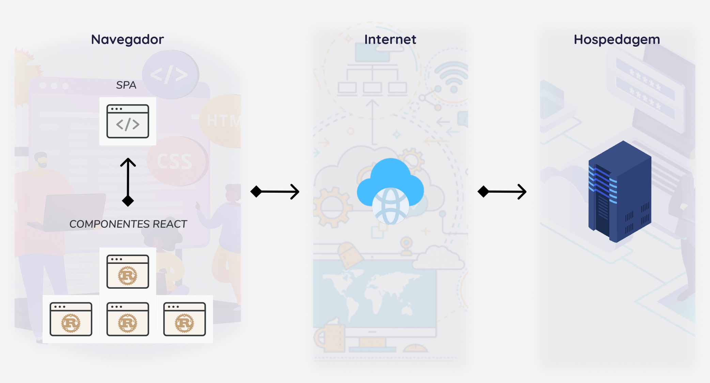

# Arquitetura da Solução

Definição de como o software é estruturado em termos dos componentes que fazem parte da solução e do ambiente de hospedagem da aplicação.

## Diagrama de componentes

Diagrama que permite a modelagem física de um sistema, através da visão dos seus componentes e relacionamentos entre os mesmos.

Os componentes que fazem parte da solução são apresentados na figura abaixo:

Figura acima - Arquitetura da Solução

A solução implementada conta com os seguintes módulos:
- **Navegador** - Interface básica do sistema  
  - **Página Web/SPA** - A aplicação será gerada por meio da biblioteca React.js, que é implementada com o Javascript, CSS e HTML e executada em um navegador. 
 - **Hospedagem** - local na Internet onde as páginas são mantidas e acessadas pelo navegador. 

A imagem a seguir ilustra a o fluxo do usuário em nossa solução para a feature Calculadora. Assim
que o usuário entra na plataforma, ele é apresentado à tela inicial
(Tela 1) onde é exposto algumas features sendo a Calculadora uma opção com três pontos de partida.

O usuário pode optar por qualquer um dos três pontos da feature Calculadora na Tela 1 que o levará para a apresentação inicial com informações/orientações iniciais (Tela 2).

Na Tela 2, no menu lateral, o usuário escolhendo a opção "Personalizado", uma tela aparecerá (Tela 3) com as opções para inserir as informações conforme orientações (ícones de interrogação ao lado de cada campo). Após completar os campos e clicar em "Calcular" ira para a príxima etapa (Tela 4).

Na Tela 4, será apresentado o resultado baseado nas informações inseridas.

## Diagrama de Classes

O diagrama de classes ilustra graficamente como será a estrutura do software, e como cada uma das classes da sua estrutura estarão interligadas. Essas classes servem de modelo para materializar os objetos que executarão na memória.

As referências abaixo irão auxiliá-lo na geração do artefato “Diagrama de Classes”.

> - [Diagramas de Classes - Documentação da IBM](https://www.ibm.com/docs/pt-br/rational-soft-arch/9.6.1?topic=diagrams-class)
> - [O que é um diagrama de classe UML? | Lucidchart](https://www.lucidchart.com/pages/pt/o-que-e-diagrama-de-classe-uml)

## Modelo ER

O Modelo ER representa através de um diagrama como as entidades (coisas, objetos) se relacionam entre si na aplicação interativa.]

## Esquema Relacional

O Esquema Relacional corresponde à representação dos dados em tabelas juntamente com as restrições de integridade e chave primária.
 
As referências abaixo irão auxiliá-lo na geração do artefato “Esquema Relacional”.

> - [Criando um modelo relacional - Documentação da IBM](https://www.ibm.com/docs/pt-br/cognos-analytics/10.2.2?topic=designer-creating-relational-model)

## Tecnologias Utilizadas

#### React
Para representarmos a camada de contato com o usuário, decidimos usar a biblioteca <a href="https://pt-br.reactjs.org/docs/getting-started.html">ReactJS</a> como front-end do projeto, realizando a parte onde se tem a interação do usuário com a página. Essa biblioteca JavaScript torna a criação de interfaces de usuário uma tarefa fácil, renderizando de forma eficiente apenas os componentes necessários, caso os dados mudem.

Os <a href="https://pt-br.reactjs.org/docs/react-component.html">componentes</a> são a base do ReactJS, são como elementos HTML personalizados, reutilizáveis, permitem dividir a interface do usuário em partes independentes e pensar em cada parte isoladamente. O React também agiliza como os dados são armazenados e tratados, usando o <a href="https://pt-br.reactjs.org/docs/state-and-lifecycle.html">estado</a> e os <a href="https://pt-br.reactjs.org/docs/render-props.html">props</a>.

#### Outras tecnologias

Ide
- **Visual studio code**

Ferramentas
- **Figma**

Linguagem
- **Javascript**
- **JSX**

Bibliotecas
- **ReactJS**

## Hospedagem

- **Heroku**

O Heroku utiliza o Git para realizar o deploy dos app.
